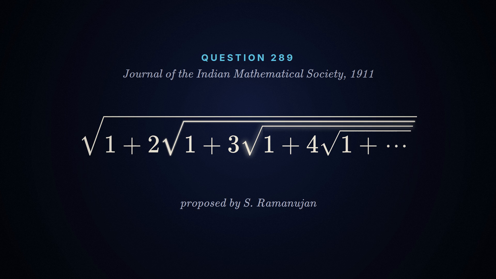

# Socratic

**Explainer videos that stop and ask you before they tell you.**

[](https://github.com/FavioVazquez/showtime) [](https://claude.com/claude-code)

A normal explainer tells you the answer while you nod along. These stop at the key steps, ask you first, tell you why your pick was right or wrong, and then go on. Each one is a real video made by a coding agent with [showtime](https://github.com/FavioVazquez/showtime), rendered locally (no API keys), with every fact on screen tied to a source.

**[Watch them](https://faviovazquez.github.io/socratic-showtime/)**

| | video | questions | length |
|---|---|---|---|
| 2 | [**Move 37 and the chain of thought**](https://faviovazquez.github.io/socratic-showtime/move37/): three frontier models, one brief, a blind vote | 4 | ~90 s each |
| 1 | [**Ramanujan's hidden step**](https://faviovazquez.github.io/socratic-showtime/ramanujan/): his 1911 nested radical, and the step even his own solution skipped | 4 | 82 s |

## Ramanujan's hidden step

[](https://faviovazquez.github.io/socratic-showtime/ramanujan/)

In 1911 Ramanujan asked readers of the *Journal of the Indian Mathematical Society* for the value of

$$\sqrt{1+2\sqrt{1+3\sqrt{1+4\sqrt{1+\cdots}}}}$$

The video asks you to guess, then walks the hidden step (3 = √9 = √(1 + 2·4), 4 = √(1 + 3·5), ...) one question at a time, and ends on the part a pattern can't give you: proving the infinite nest settles at all. His published solution (1912) left that out; the convergence argument came in the 1927 *Collected Papers* and in Herschfeld (1935). Sources are in [`ramanujan/claims.md`](ramanujan/claims.md).

Two versions:
- **Interactive** ([open it](https://faviovazquez.github.io/socratic-showtime/ramanujan/)): the video pauses at each question and waits for your answer.
- **MP4** ([`ramanujan/ramanujan-socratic-1920x1080.mp4`](ramanujan/ramanujan-socratic-1920x1080.mp4)): each question is a "pause and think" beat with a 3-second countdown, for places that only play video.

## How it works

The video is a [showtime](https://github.com/FavioVazquez/showtime) project, exported two ways from the same timeline: an MP4, and a single HTML page (`showtime export html`) that plays the same scenes live in the browser. [`socratic/socratic.js`](socratic/socratic.js) (about 160 lines, no dependencies) drives that page through its player API and reads one small file:

```json
{
  "questions": [
    { "id": "q1", "pause": 9.2, "resume": 12.4,
      "prompt": "What is it equal to?",
      "choices": ["2", "3", "It grows forever"], "answer": 1,
      "feedback": ["Too small...", "Yes...", "It climbs, but..."] }
  ]
}
```

At `pause` the video stops and the question appears. After the viewer answers, it plays on from `resume`, the end of the countdown beat the MP4 shows instead. Seeking past a question skips it; seeking back re-asks. Keys: A-C or 1-3 to answer, Enter to go on.

To add a video, put its folder next to `ramanujan/`: the exported `.html`, a `socratic.json`, a `poster.png` and an `index.html` like `ramanujan/index.html`.

## Made with

- **[Claude Code](https://claude.com/claude-code)** with **Claude Opus 5.5** ([Anthropic](https://www.anthropic.com)): picked the topic, checked the history against the primary sources, wrote the question layer and this repo.
- **[Devin](https://devin.ai)** ([Cognition](https://cognition.ai)) running Claude Opus 5.5: built and rendered the video with showtime on one CPU machine.
- **[showtime](https://github.com/FavioVazquez/showtime)**: the open-source video studio for coding agents that renders it all locally: scenes, the local voice, music, the review pass, and the HTML export. Stop-and-ask questions are planned as a built-in showtime feature.

Want your agent to make one? In Claude Code: `/plugin marketplace add FavioVazquez/showtime`, or `npx skills add FavioVazquez/showtime` for other agents.

Code: MIT. Videos and text: CC BY 4.0.
